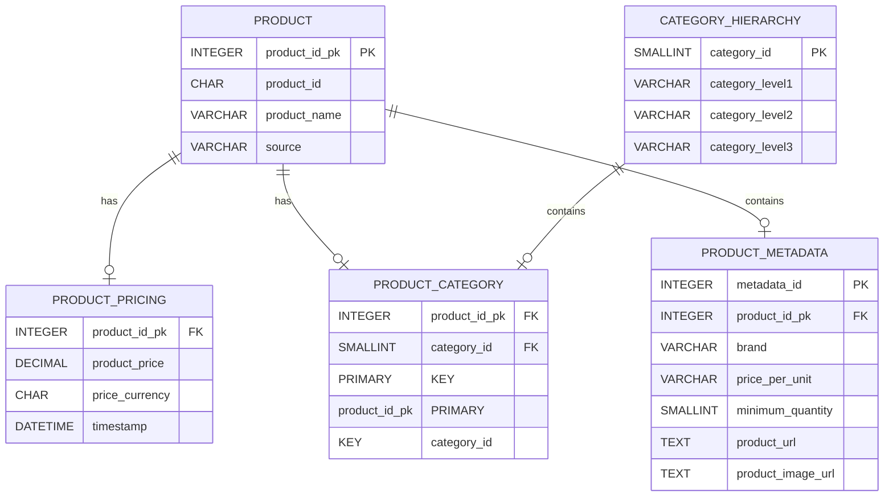

continente_price_tracker
==============================

A simple ETL tool to track item pricing

TODO:

- Add pipeline visualization and logging
    - Pipeline is decomposed in 3 service providers, each one should have a status
- Add pipeline metrics (number of files created, total lines, time elapsed, sum null per column)
    
Project Organization
------------

    ├── LICENSE
    ├── Makefile           <- Makefile with commands like `make data` or `make train`
    ├── README.md          <- The top-level README for developers using this project.
    ├── data
    │   ├── external       <- Data from third party sources.
    │   ├── interim        <- Intermediate data that has been transformed.
    │   ├── processed      <- The final, canonical data sets for modeling.
    │   └── raw            <- The original, immutable data dump.
    │
    ├── docs               <- A default Sphinx project; see sphinx-doc.org for details
    │
    ├── models             <- Trained and serialized models, model predictions, or model summaries
    │
    ├── notebooks          <- Jupyter notebooks. Naming convention is a number (for ordering),
    │                         the creator's initials, and a short `-` delimited description, e.g.
    │                         `1.0-jqp-initial-data-exploration`.
    │
    ├── references         <- Data dictionaries, manuals, and all other explanatory materials.
    │
    ├── reports            <- Generated analysis as HTML, PDF, LaTeX, etc.
    │   └── figures        <- Generated graphics and figures to be used in reporting
    │
    ├── requirements.txt   <- The requirements file for reproducing the analysis environment, e.g.
    │                         generated with `pip freeze > requirements.txt`
    │
    ├── setup.py           <- makes project pip installable (pip install -e .) so src can be imported
    ├── src                <- Source code for use in this project.
    │   ├── __init__.py    <- Makes src a Python module
    │   │
    │   ├── data           <- Scripts to download or generate data
    │   │   └── make_dataset.py
    │   │
    │   ├── features       <- Scripts to turn raw data into features for modeling
    │   │   └── build_features.py
    │   │
    │   ├── models         <- Scripts to train models and then use trained models to make
    │   │   │                 predictions
    │   │   ├── predict_model.py
    │   │   └── train_model.py
    │   │
    │   └── visualization  <- Scripts to create exploratory and results oriented visualizations
    │       └── visualize.py
    │
    └── tox.ini            <- tox file with settings for running tox; see tox.readthedocs.io

--------

<small>Project based on the <a target="_blank" href="https://drivendata.github.io/cookiecutter-data-science/">cookiecutter data science project template</a>. #cookiecutterdatascience</small>

Include essential information in every log entry:

    Timestamp
    Log level (e.g., INFO, WARNING, ERROR, CRITICAL)
    Message
    Source (e.g., class name, method name, or file name)1
    3

Add contextual information:

    User ID or username (if applicable)
    Session ID
    Request ID or transaction ID
    Environment information (e.g., production, staging, development)2
    4

For error logs, include:

    Stack trace
    Error code
    Error message
    Exception details1
    5

Enrich logs with additional data:

    GeoIP information for IP addresses
    Metadata from CSV files or databases (e.g., system roles, administrator contact info)
    Custom name-value pairs based on message content4

Use structured logging formats (e.g., JSON) to make logs easily parseable and searchable4
Implement log levels and use them appropriately:

    TRACE for detailed debugging
    DEBUG for general debugging
    INFO for general information
    WARN for warning messages
    ERROR for error messages
    FATAL for critical errors3

given an input dataframe with this struct

[
0:
"product_id"
1:
"product_name"
2:
"product_price"
3:
"product_category"
4:
"product_category2"
5:
"product_category3"
6:
"product_image"
7:
"product_urls"
8:
"product_ratings"
9:
"product_labels"
10:
"product_promotions"
11:
"source"
12:
"timestamp"
]

create functions to take it as input and return a dataframe which match the following requirements:

func name auchan_product_table output df Expected columns: product_id, product_name, source.
func name auchan_category_table output df Expected columns: product_category, product_category2, product_category3.
func name product_category_table product_id, source, product_category, product_category2, product_category3.